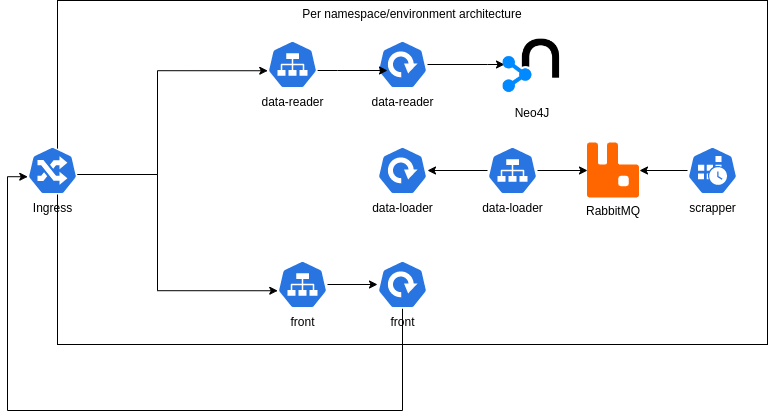

# PFE Search Engine Infrastructure

## Introduction

This repository is the infrastructure for the PFE Search Engine Project.

> **Note**
> You can find the app repository [here](https://github.com/hajali-amine/pfe-search-engine).

## Architecture

The Cluster looks like the following.


Per environment we have the following architecture.



## Tools

For the implementation of the infrastructure the following tools were used.

### IaC tools

- Kubernetes
- Kustomize
- Terraform
- Helm

### Productivity tools

- Lens, a tool to manage your cluster.
  

### Monitoring tools

- Grafana, for dashboards.
- Prometheus, to store metrics.
- Node Exporter, to get cluster nodes metrics.
- SigNoz, to collect traces and visualize them.

## Setting up the cluster

To set-up the cluster I opted for a micro-stack architecture using Terraform. All of them have remote backends set to an Azure Blob Container.

### Cluster provisioning

The cluster micro-stack will provision the AKS cluster with a node pool of two nodes of type `Standard_D2_v2`. It will output the kube-config for the other stacks to use.

### Namespaces creation

This will be created using `kubernetes` provider. The project has three workspaces; `prod`, `dev` and `qa`.

### Monitoring set-up

The terraform project uses `kubernetes` and `helm` provider. It will first create the `monitoring-v2` namespace.

Then it will proceed to install SigNoz and Prometheus helm-charts and apply a Grafana deployment.

The root project uses two modules;

- SigNoz
- Prometheus - which contains Grafana too.

### Neo4J set-up

It contains two workspaces, `prod` and `dev`. And will provision a Neo4J database in both of them.

We will not create a Neo4J database in `qa` to save costs. The `qa` environment will use `dev`'s database.

### RabbitMQ operator set-up

We will provision RabbitMQ Operator through its Helm Chart.

### Ingresses set-up

The root project will set-up the Nginx controller and then proceed to provision the module Ingress 4 times - for each namespace we have.

## Applying the app

You simply go to the K8S folder and apply it through Kustomize.

``` shell
kubectl apply -k prod
kubectl apply -k dev
kubectl apply -k qa
```

## Setting up the final touches

Add the following to your `/etc/hosts` and start the adventure.

```
<INGRESS_IP>   signoz.pfesearchengine.com
<INGRESS_IP>   grafana.pfesearchengine.com
<INGRESS_IP>   pfesearchengine.com
<INGRESS_IP>   api.pfesearchengine.com
<INGRESS_IP>   dev.pfesearchengine.com
<INGRESS_IP>   api.dev.pfesearchengine.com
<INGRESS_IP>   qa.pfesearchengine.com
<INGRESS_IP>   api.qa.pfesearchengine.com

```
